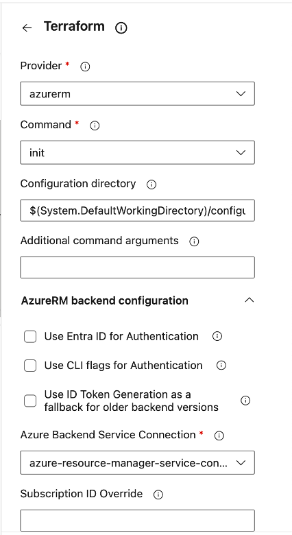
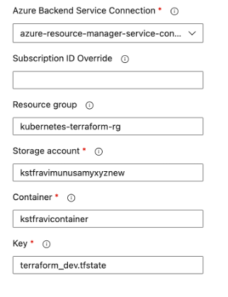
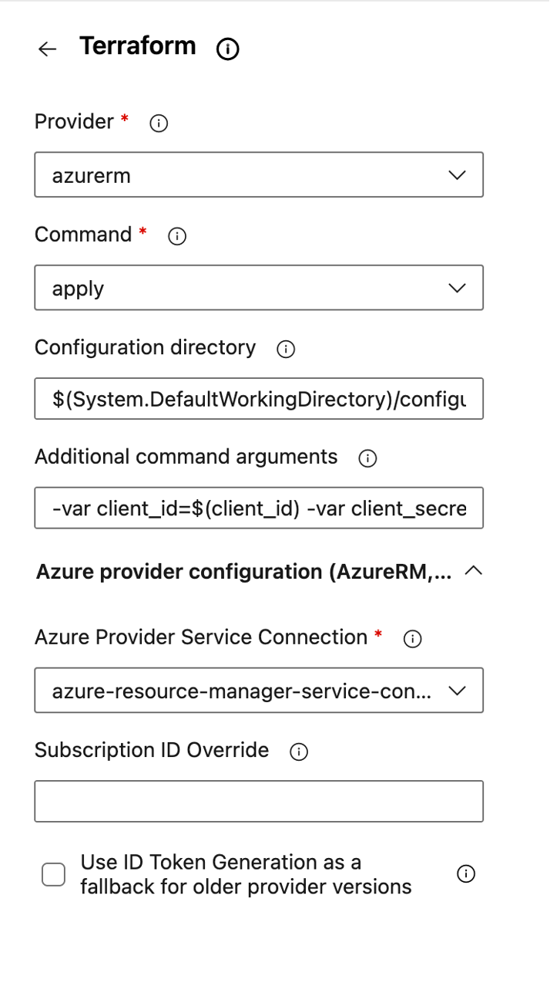

# 148.Step 03 - Creating Azure DevOps Pipeline for Azure Kubernetes Cluster IAAC. 
When you create a service connection to azure resource manager, the screens changed a bit. Choose Azure Resource Manager as explained in the video and the next screens look as below
1. Choose option Service Principle (Automatic)

2. Choose the azure subscription from drop down, leave Resource Group Empty, provide the service connection name 
Also choose Grand access permission to all pipelines and click Save

# 152. Step 03 - Creating Azure DevOps Pipeline for Azure Kubernetes Cluster IAAC - 3:50
# Azure DevOps Pipeline Migration - Terraform Tasks

## Overview

The **Azure Pipelines Terraform Tasks by Charles Zipp** extension is no longer available in the Azure DevOps Marketplace.

The pipeline has been updated to use the **Microsoft DevLabs Terraform Tasks** extension instead.

This guide explains only the changes required for the migration.

---

## Key Changes

| Old Pipeline | New Pipeline |
|---|---|
| `TerraformCLI@0` | `TerraformTask@5` |
| Charles Zipp Terraform task | Microsoft DevLabs Terraform task |
| Terraform installer not required | Terraform installer required |
| `environmentServiceName` | `environmentServiceNameAzureRM` |
| `ensureBackend: true` | Backend must already exist |
| Provider not required | `provider: 'azurerm'` required |

---

## Step 1 - Install Microsoft DevLabs Terraform Extension

Install the Microsoft DevLabs Terraform extension in Azure DevOps.

```text
Extension: Terraform Tasks for Azure Pipelines
Publisher: Microsoft DevLabs
Marketplace: https://marketplace.visualstudio.com/items?itemName=ms-devlabs.custom-terraform-tasks
```

---

## Step 2 - Add Terraform Installer Task

Add this task before running any Terraform commands.

```yaml
- task: ms-devlabs.custom-terraform-tasks.custom-terraform-installer-task.TerraformInstaller@1
  displayName: 'Install Terraform'
  inputs:
    terraformVersion: 'latest'
```

---

## Step 3 - Replace Old Terraform Task

Old task:

```yaml
- task: TerraformCLI@0
```

New task:

```yaml
- task: TerraformTask@5
```

---

## Step 4 - Update Terraform Init Task

Use the Microsoft DevLabs `TerraformTask@5` task for Terraform initialization.

```yaml
- task: TerraformTask@5
  inputs:
    provider: 'azurerm'
    command: 'init'
    workingDirectory: '$(System.DefaultWorkingDirectory)/configuration/iaac/azure/kubernetes'
    backendAzureRmUseEntraIdForAuthentication: false
    backendServiceArm: 'azure-resource-manager-service-connection'
    backendAzureRmResourceGroupName: 'kubernetes-terraform-rg'
    backendAzureRmStorageAccountName: 'storageacctrangaxyz'
    backendAzureRmContainerName: 'storageacctrangacontainer'
    backendAzureRmKey: 'terraform_dev.tfstate'
```



---

## Step 5 - Create Backend Resources Manually

The old Charles Zipp task supported:

```yaml
ensureBackend: true
```

The Microsoft DevLabs task does not create the backend resources automatically.

Before running the pipeline, manually create the following Azure resources:

```text
Resource Group: kubernetes-terraform-rg
Storage Account: storageacctrangaxyz
Blob Container: storageacctrangacontainer
State File: terraform_dev.tfstate
```

The state file is created by Terraform, but the resource group, storage account, and container must already exist.



---

## Step 6 - Update Terraform Apply Task

Use `TerraformTask@5` and replace `environmentServiceName` with `environmentServiceNameAzureRM`.

```yaml
- task: TerraformTask@5
  inputs:
    provider: 'azurerm'
    command: 'apply'
    workingDirectory: '$(System.DefaultWorkingDirectory)/configuration/iaac/azure/kubernetes'
    commandOptions: '-var client_id=$(client_id) -var client_secret=$(client_secret) -var ssh_public_key=$(publickey.secureFilePath)'
    environmentServiceNameAzureRM: 'azure-resource-manager-service-connection'
```



---

## Step 7 - Update Terraform Destroy Task

Use the same Microsoft DevLabs task for destroy.

```yaml
- task: TerraformTask@5
  inputs:
    provider: 'azurerm'
    command: 'destroy'
    workingDirectory: '$(System.DefaultWorkingDirectory)/configuration/iaac/azure/kubernetes'
    commandOptions: '-var client_id=$(client_id) -var client_secret=$(client_secret) -var ssh_public_key=$(publickey.secureFilePath)'
    environmentServiceNameAzureRM: 'azure-resource-manager-service-connection'
```

---

## Complete Updated Pipeline

```yaml
trigger:
- master

pool:
  vmImage: 'ubuntu-latest'

steps:
- script: echo K8S Terraform Azure!
  displayName: 'Run a one-line script'

- task: ms-devlabs.custom-terraform-tasks.custom-terraform-installer-task.TerraformInstaller@1
  displayName: 'Install Terraform'
  inputs:
    terraformVersion: 'latest'

- task: DownloadSecureFile@1
  name: publickey
  inputs:
    secureFile: 'azure_rsa.pub'

- task: TerraformTask@5
  inputs:
    provider: 'azurerm'
    command: 'init'
    workingDirectory: '$(System.DefaultWorkingDirectory)/configuration/iaac/azure/kubernetes'
    backendAzureRmUseEntraIdForAuthentication: false
    backendServiceArm: 'azure-resource-manager-service-connection'
    backendAzureRmResourceGroupName: 'kubernetes-terraform-rg'
    backendAzureRmStorageAccountName: 'storageacctrangaxyz'
    backendAzureRmContainerName: 'storageacctrangacontainer'
    backendAzureRmKey: 'terraform_dev.tfstate'

- task: TerraformTask@5
  inputs:
    provider: 'azurerm'
    command: 'apply'
    workingDirectory: '$(System.DefaultWorkingDirectory)/configuration/iaac/azure/kubernetes'
    commandOptions: '-var client_id=$(client_id) -var client_secret=$(client_secret) -var ssh_public_key=$(publickey.secureFilePath)'
    environmentServiceNameAzureRM: 'azure-resource-manager-service-connection'

- task: TerraformTask@5
  inputs:
    provider: 'azurerm'
    command: 'destroy'
    workingDirectory: '$(System.DefaultWorkingDirectory)/configuration/iaac/azure/kubernetes'
    commandOptions: '-var client_id=$(client_id) -var client_secret=$(client_secret) -var ssh_public_key=$(publickey.secureFilePath)'
    environmentServiceNameAzureRM: 'azure-resource-manager-service-connection'
```

---

## Summary

To migrate from Charles Zipp Terraform tasks to Microsoft DevLabs Terraform tasks:

1. Install the Microsoft DevLabs Terraform extension.
2. Add the Terraform installer task.
3. Replace `TerraformCLI@0` with `TerraformTask@5`.
4. Add `provider: 'azurerm'`.
5. Replace `environmentServiceName` with `environmentServiceNameAzureRM`.
6. Remove `ensureBackend: true`.
7. Create the backend resource group, storage account, and blob container manually before running the pipeline.

# 152. Step 06 - Creating Azure DevOps Pipeline for Deploying Microservice to Azure AKS 1:30

Creating service connection for Kubernetes has to be done differently because of the open issue.


1. Do az login in your cmd. This will open up your browser and need to select the account and log in.
2. run az aks get-credentials --name <name of the kubernetes cluster created> --resource-group <name of the resource group> --admin;
3. run cat ~/.kube/config; this command will show you config file details.
4. copy all content of files to your favourite text editor.
5. go to your service connection and choose KubeConfig from top radio button.
6. paste notepad's content in KubeConfig box.
7. choose cluster context <name of the cluster>
8. click on verify if its success then your job done. If you face any problems here, take a back up of the config file (~/.kube/config) and delete it. Run the command in step 2 again so that the config file contains only this kubernetes cluster.
9. Give connection name and click on last checkbox for permission.


 # 159. Step 01 - Review Terraform Configuration for AWS EKS Cluster Creation

AWS EKS has changed some of the configurations so we have udpated our repository with latest code.

1. The main.tf file now contains sections for creating EKS and then creating policy bindings after EKS is created. The sections which needs to be executed after the EKS creation are commented out now.
2. Follow the instructions given in the video to create the EKS cluster. There is no change in that.
3. Once the cluster is created, edit the main.tf and uncomment the sections marked as below

```
//>>Uncomment this section once EKS is created - Start
//>>Uncomment this section once EKS is created - End
```
and commit the file again. This will trigger the pipeline and policy bindings will be created.

4. Your final main.tf should look like the file final-main.txt in the same folder. You can compare your file with this one.
